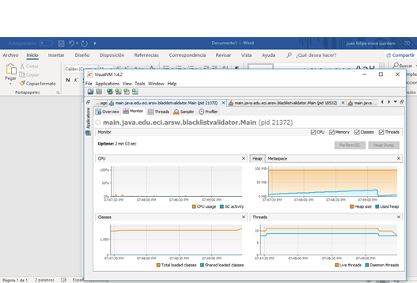
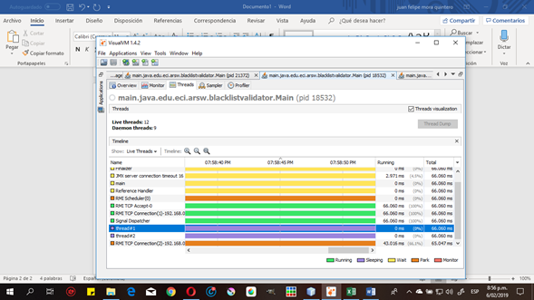
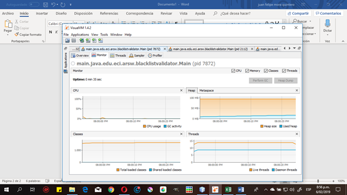
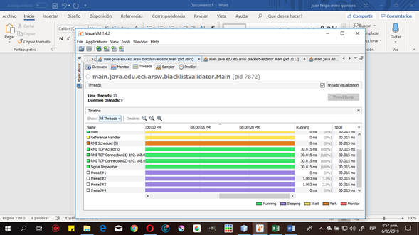
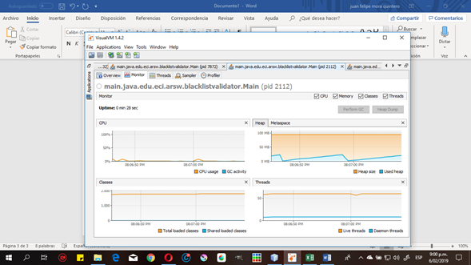
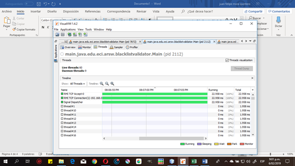
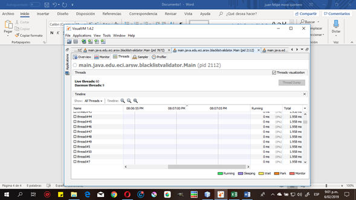
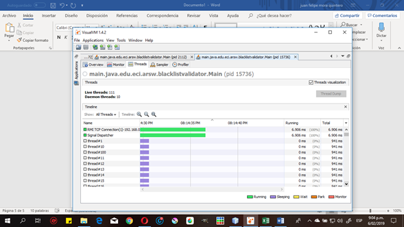
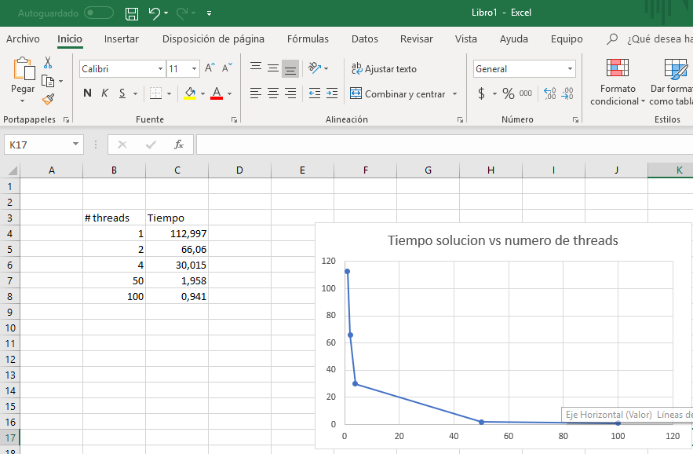

**Part I - Introduction to threads in JAVA**

Change the beginning with start() to run(). How does the output change? Why?
La diferencia en aplicar el Start o el run es que al aplicar solo en run inicia el thread sin importar los pasos anteriores de la iniciacion
en cambio si se inicia con el Start el thread se va a iniciar completamente cumpliendo el orden de un thread

**Part III - Discussion**

How could the implementation be modified to minimize the number of queries in these cases?
Lo que modificariamos seria agregar un valor global el cual se encargue de llevar el conteo de las ocurrencias y asi cuando llegue al minimo se detengan todos los threads

What new element would this bring to the problem?
El problema seria que no se podria confirmar adecuadamente que el valor que este en esta variable se adecuado.

**Part IV - Performance Evaluation** 

A single thread Time = 112.997

As many threads as processing cores (have the program determine this using the Runtime API). Time: 66.06

As many threads as twice the number of processing cores. Time: 30.015

50 threads Time: 1.958

100 threads Time: 0.941

**1 thread**

**2 threads**

**4 threads** 

**50 threads** 

**100 threads**

**Tabla**

**Why is the best performance not achieved with the 500 threads? How is this performance compared when using 200 ?.**

Al momento de realizar la operacion con 500 threads se puede observar que este proceso toma unos cuantos segundos mas que si se realizara con 100, esto se debe a que entre mas hilos se tengan y esta cantidad sea mayor al numero de nucleos disponibles en el sistema operativo, no todos los hilos podran correr de manera paralela, si no que empezaran a ir uno detras del otro, entonces se tiene que ciertos hilos tienen una asignacion determinada por el sitema operativo, pero en donde al haber demasiados hilos, muchos se veran negativamente afectados por la asignacion 'justa' del tiempo de computo y al bajar la cantidad de hilos a 200 se observa este tiempo se ajusta un poco al tiempo de los 100 threads

**How does the solution behave using as many processing threads as cores compared to the result of using twice as much?**

Se puede observar que cuando se utilizan la misma cantidad de hilos que de nucleos el tiempo de ejecucion va a ser bajo, pero al aumentarle la cantidad al doble se observa como este tiempo se va a ver disminuido aumentando asi la eficiencia del trabajo de cada uno de los hilos

**According to the above, if for this problem instead of 100 threads in a single CPU could be used 1 thread in each of 100 hypothetical machines, Amdahls law would apply better ?. If x threads are used instead of 100/x distributed machines (where x is the number of cores of these machines), would it be improved? Explain your answer.**

Basandonos en la suposicion de que el nucleo este totalmente dedicado al proceso de un hilo, el tiempo de ejecucion si se tienen 100 maquinas corriendo cada una u hilo sera similar al de ejecutarlos todos en un solo computador, pero al ver en la practica que los nucleos de un sistema operativo no se van a dedicar completamente a un solo hilo, se vera que utilizar en 100 maquinas un hilo en cada una sera mas eficiente.

